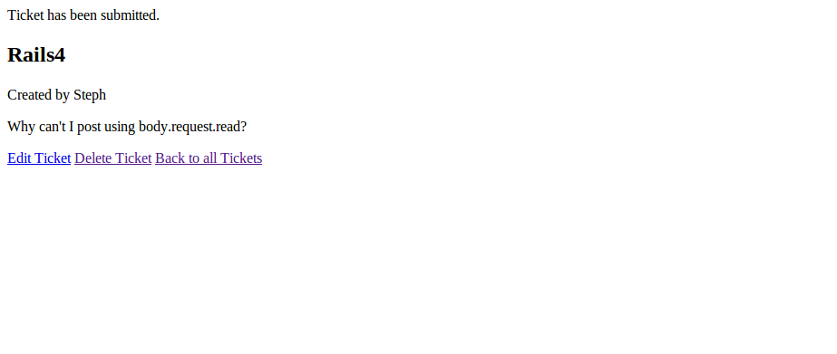
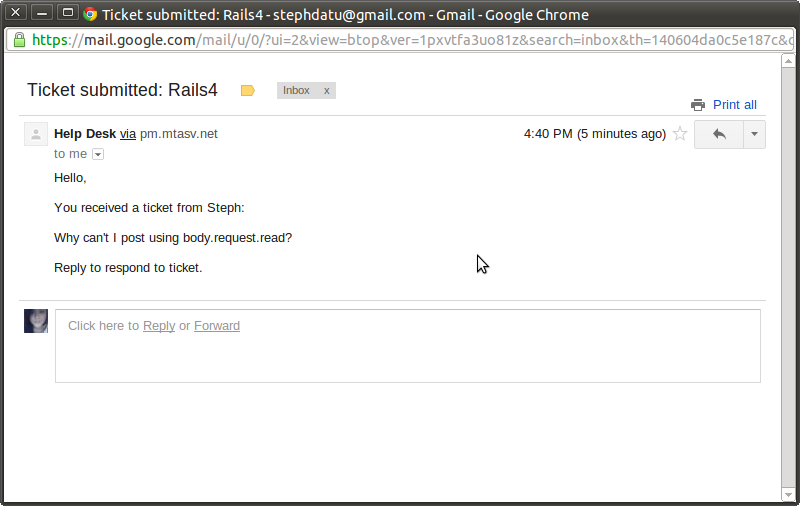
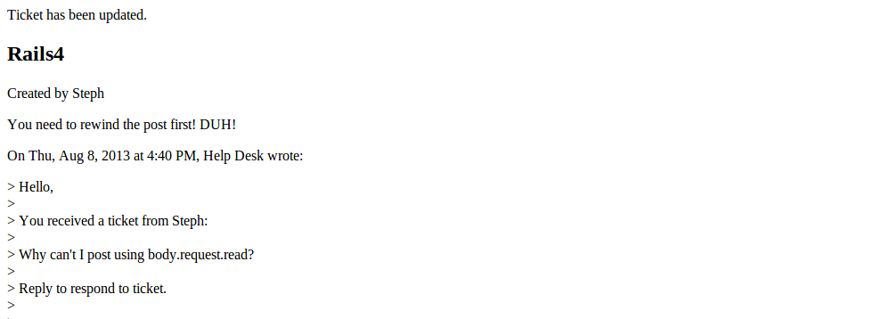

# Help Desk

By [Stephanie Datu](http://blog.stephdatu.com).


## Description
**Help Desk** is a simple application where you can post your help requests. Each ticket you submit sends an email to our live help desk coordinator, who will respond to your ticket as soon as possible!

A live view of the application can be found at (http://steph-datu-helpdesk.herokuapp.com)

## Installation

Run the following commands to install it:

```console
git clone https://github.com/stephdatu/helpdesk
bundle install
```

Run the server:

```console
rails server
```


## Usage

Just click "Submit a Ticket" at the top of the page to begin entering your help desk request.


## Information

Screenshots of your application below:






### Known Issues

If you discover any bugs, feel free to create an issue on GitHub fork and
send us a pull request.

## Author

* Stephanie Datu (https://github.com/stephdatu)

## License

The MIT License (MIT)
